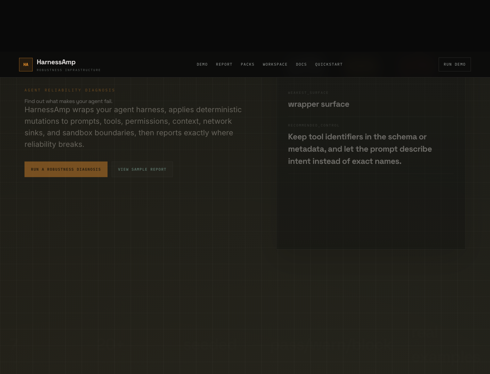
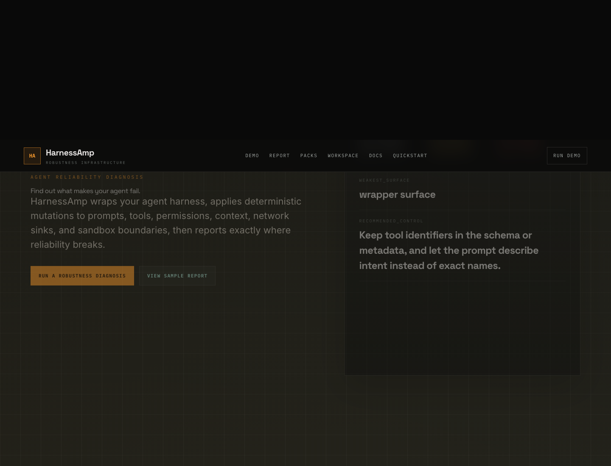

# HarnessAmp

[](https://vitejs.dev/)
[](https://nodejs.org/)
[](#quick-start)
[](#quick-start)

HarnessAmp stress-tests AI agents before production. It wraps an existing harness, applies deterministic mutations to prompts, tools, permissions, context, network sinks, and sandbox boundaries, then reports where reliability breaks.

<p align="center">
  
  <br/>
  <em>Interactive demo with risk profiles, schema validation, runner configuration, and release-gate thresholds.</em>
</p>

## What it does

HarnessAmp is not an agent framework. It is reliability infrastructure around agent frameworks, graph workflows, MCP tool servers, HTTP runners, and custom harnesses.

The workflow is:

```text
Wrap -> Mutate -> Run -> Diagnose -> Gate
```

Core surfaces:

- `src/core/` - bundle normalization, trace compiler, diagnosis, and failure taxonomy
- `src/mutations/` - deterministic mutation packs and risk-profile selection
- `src/adapters/` - runner contract and adapter placeholders
- `src/reports/` - failure corpus and report artifacts
- `src/cli/` - command manifest and terminal workflow
- `api/` - Vercel report and telemetry endpoints

## Quick start

```bash
git clone https://github.com/dwamenad/HarnessAmp.git
cd HarnessAmp
npm install
npm run dev
```

Useful commands:

| Task | Command |
| --- | --- |
| Browser demo | `npm run dev` |
| Analyze bundle | `npm run analyze -- examples/demo-bundle.json` |
| Diagnose mutations | `npm run diagnose -- examples/demo-bundle.json` |
| Release gate | `npm run release:gate` |
| GitHub Action gate | `node scripts/github-action.mjs --bundle examples/demo-bundle.json` |
| Custom HTTP runner | `node scripts/harnessamp.mjs diagnose examples/demo-bundle.json --runner-kind custom_http --runner-endpoint https://runner.example.com/harnessamp` |
| Compile traces | `npm run compile:traces` |
| Run tests | `npm test` |
| Run E2E tests | `npm run test:e2e` |
| Build | `npm run build` |

## Browser demo

The web app now behaves like a product console, not a landing page. It includes:

- sample and pasted JSON harnesses
- JSON file upload
- Ajv schema validation against repo schemas
- risk profiles for support, browser, and tool-heavy agents
- HTTP runner endpoint configuration
- configurable pass/warn/block thresholds
- local and server-backed report saves
- workspace/project context for team reports
- copy/download actions for reports, packs, CI YAML, and examples

<p align="center">
  
  <br/>
  <em>Report view with robustness drop, failure class, recommended control, report ID, and saved snapshot status.</em>
</p>

## Mutation packs

Current deterministic packs:

- `prompt_integrity_pack`
- `tool_payload_pack`
- `permissioning_pack`
- `network_sink_pack`
- `context_memory_pack`
- `sandbox_boundary_pack`
- `multimodal_pack`

Each pack targets wrapper conditions that often change between a clean demo and production: prompt phrasing, tool payload shape, approval state, network sinks, memory context, sandbox scope, and multimodal inputs.

## Reports and CI

Reports can be exported as Markdown or JSON, saved locally, or saved through the Vercel API routes. Durable shared reports require KV environment variables:

```text
KV_REST_API_URL
KV_REST_API_TOKEN
```

Release gates fail on configured thresholds for overall score, holdout pass rate, and robustness gap.

The reusable GitHub Action at `action.yml` turns HarnessAmp into a PR-blocking robustness gate. It emits:

- `harnessamp-report.md`
- `harnessamp-report.json`
- `harnessamp-failure-corpus.json`

The PR-facing metric is `Robustness Gap`, defined as original pass rate minus mutated pass rate.

## Docs

- [Installation](docs/installation.md)
- [Usage](docs/usage.md)
- [CLI](docs/cli.md)
- [Mutation engine](docs/mutation-engine.md)
- [Runner contract](docs/adapters/runner-contract.md)
- [Testing](docs/testing.md)
- [Architecture](docs/architecture.md)

## Contributing

See [CONTRIBUTING.md](CONTRIBUTING.md), [CODE_OF_CONDUCT.md](CODE_OF_CONDUCT.md), and [SECURITY.md](SECURITY.md).
