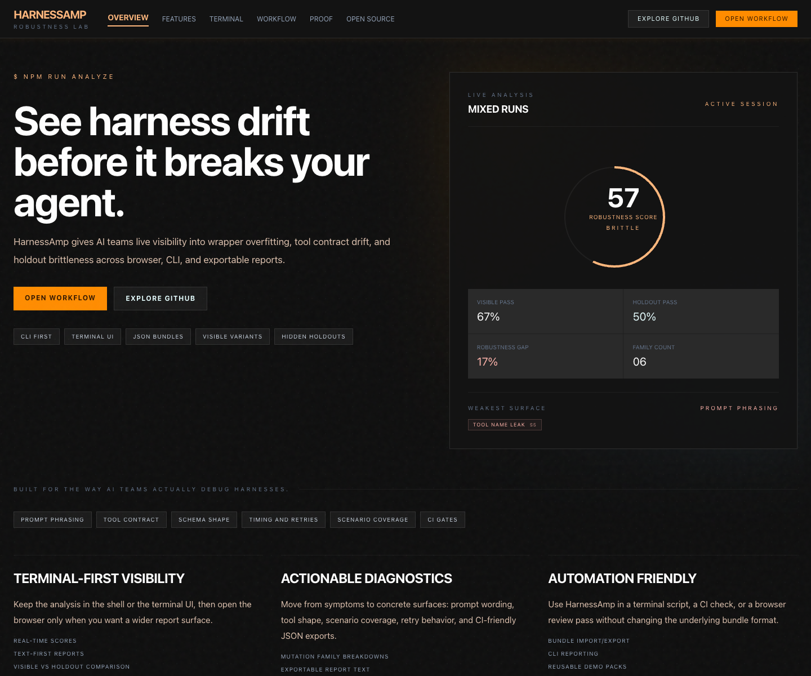
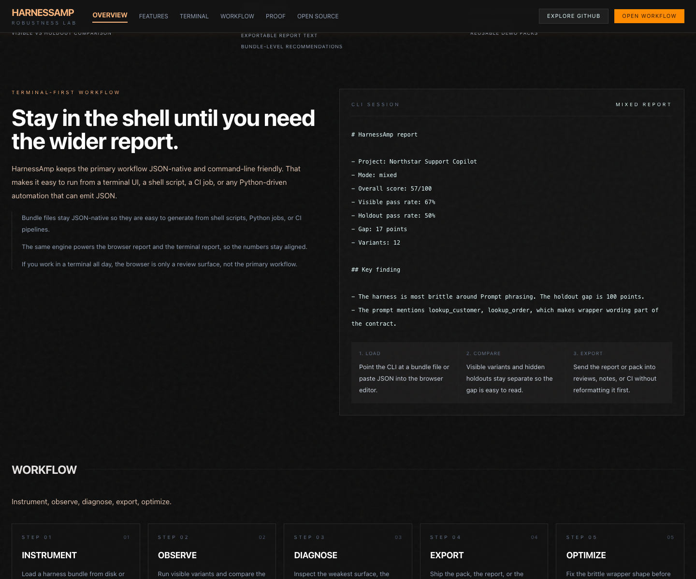

# HarnessAmp

[](https://vitejs.dev/)
[](https://nodejs.org/)
[](#browser-workbench)
[](#terminal-ui)
[](#quick-start)

<p align="center">
  
  <br/>
  <em>Browser workbench showing the live robustness score, mutation families, and hidden holdout gap.</em>
</p>

HarnessAmp is a harness-hardening lab for AI agents. It combines a browser workbench, a terminal CLI, and a shared analysis engine so you can move from bundle to report to exported pack without switching tools.

The browser UI is now structured around four separate layers:

- `intent` - the mission the system is supposed to preserve
- `contract` - the hard boundaries, role rules, and required behaviors
- `benchmark` - the cases and assertions that prove the contract
- `wrapper` - the mutable prompt, tool, schema, and runtime layer under stress test

It is optimized for terminal-first and CLI-first workflows:

- JSON bundles that are easy to generate from shell scripts or Python jobs
- live reports that can be inspected in the browser or pasted into a terminal window
- visible and hidden variants that surface wrapper drift before release
- approved trace corpora that can be compiled into draft intent, contract, and benchmark packs
- failure corpora that accumulate real wrapper regressions over time
- release gates that can fail CI on holdout regressions before merge

## Why use this tool

- Catch wrapper drift before it becomes a shipping bug.
- Compare visible variants against hidden holdouts.
- Diagnose whether the brittle surface is prompt wording, tool contracts, schema shape, timing, or scenario coverage.
- Export report text and pack JSON for CI, PR review, or incident notes.
- Keep the same analysis path available from a browser, shell, or automated job.

## Installation

### From source

```bash
git clone https://github.com/dwamenad/HarnessAmp.git
cd HarnessAmp
npm install
npm run dev
```

### Common commands

| Task | Command |
| --- | --- |
| Start the browser workbench | `npm run dev` |
| Run the terminal report | `npm run analyze` |
| Compile approved traces into a draft contract | `npm run compile:traces` |
| Collect a failure corpus | `npm run collect:failures` |
| Run a release gate | `npm run release:gate` |
| Run mutation diagnosis | `npm run diagnose -- examples/demo-bundle.json` |
| Analyze a bundle file | `npm run analyze -- examples/demo-bundle.json` |
| Export the generated pack JSON | `npm run analyze -- examples/demo-bundle.json --pack` |
| Build for production | `npm run build` |
| Run the tests | `npm test` |
| Build the Docker image | `npm run docker:build` |
| Run the Docker image | `npm run docker:run` |

## Quick start

### CLI-first workflow

This is the fastest path when you want the report in a terminal window, shell script, or CI log:

```bash
npm run analyze -- examples/cli/quickstart-bundle.json
npm run analyze -- examples/cli/quickstart-bundle.json examples/cli/observed-runs.json
npm run analyze -- examples/cli/quickstart-bundle.json --pack
```

### Browser workbench

Open `npm run dev`, paste a harness bundle, and compare visible variants against hidden holdouts from the inspector panel.

The browser and terminal use the same analysis engine, so the score, gap, and weakest surface stay aligned across both surfaces.

The first read in the browser should be the layer model:

1. Intent
2. Contract
3. Benchmark
4. Wrapper

If the first three layers are still inferred, the drift score is useful as a diagnostic but not strong enough to act as a release gate.

## Terminal UI

The terminal view is the main review surface for CLI-first workflows. It keeps the current report text visible in a shell-friendly format so you can copy it into notes, PRs, or CI logs.

<p align="center">
  
  <br/>
  <em>Terminal-first report view with the same analysis text used by the browser UI.</em>
</p>

Use the CLI when you want the shortest path from bundle to diagnosis:

```bash
npm run analyze -- examples/demo-bundle.json
npm run analyze -- examples/demo-bundle.json examples/cli/observed-runs.json
npm run analyze -- examples/demo-bundle.json --pack
```

The report highlights:

- visible vs hidden pass rates
- the robustness gap
- the weakest surface family
- short recommendations for hardening

## Trace-to-contract compiler

When you already have approved traces but do not yet have a clean benchmark pack, use the trace compiler:

```bash
npm run compile:traces
npm run compile:traces -- examples/traces/approved-support-traces.json
npm run compile:traces -- examples/traces/approved-support-traces.json --pack
```

The compiler produces a draft:

- `intent` section with a mission and success signals
- `contract` section with per-agent role boundaries and allowed tools
- `benchmark` section with case drafts, milestones, and assertions
- `wrapper` scaffold that the mutation engine can execute immediately

This is the front half of the product: define what the system is supposed to preserve before you start mutating the wrapper around it.

## Failure corpus

Collect failed visible and holdout variants into a reusable corpus:

```bash
npm run collect:failures -- examples/demo-bundle.json examples/cli/observed-runs.json
npm run collect:failures -- examples/demo-bundle.json examples/cli/observed-runs.json --report
```

Each entry stores:

- source pack version
- mutated surface and tier
- failure type
- observed versus expected behavior
- fix candidates

That corpus is where a better mutation library should come from.

## Release gate

Gate CI on holdout performance and score thresholds:

```bash
npm run release:gate -- examples/demo-bundle.json examples/cli/observed-runs.json --min-holdout-pass 15 --max-gap 60 --min-overall-score 55
```

The repo now includes a GitHub Actions workflow at `.github/workflows/release-gate.yml` that runs the gate, writes markdown/json artifacts, and uploads them on every pull request.

## Mutation diagnosis

HarnessAmp now has a production-oriented mutation registry and diagnosis path:

```bash
node scripts/harnessamp.mjs validate examples/demo-bundle.json
node scripts/harnessamp.mjs mutate examples/demo-bundle.json --max-mutations 20
npm run diagnose -- examples/demo-bundle.json
```

The diagnosis flow runs deterministic mutation packs through the mock runner, computes behavioral deltas, classifies failures, and returns a `PASS`, `WARN`, or `BLOCK` recommendation.

Current mutation packs:

- `prompt_integrity_pack`
- `tool_payload_pack`
- `permissioning_pack`
- `network_sink_pack`
- `context_memory_pack`
- `sandbox_boundary_pack`
- `multimodal_pack`

See [Mutation Engine](docs/mutation-engine.md) for the registry format and risk-profile selection model.

## Docker

To run the production build in a container:

```bash
PATH="/Applications/Docker.app/Contents/Resources/bin:$PATH" npm run docker:build
PATH="/Applications/Docker.app/Contents/Resources/bin:$PATH" docker run --rm -p 8088:80 harnessamp:local
```

Then open `http://127.0.0.1:8088`.

## What the product is for

HarnessAmp is not a benchmark runner. It is a harness hardening tool.

It looks for cases where an agent only succeeds because it learned one exact wrapper:

- prompt wording
- tool names
- schema layout
- retry timing
- scenario order

HarnessAmp mutates those surfaces and highlights the widest gaps so you can fix brittle parts before release.

## Examples and walkthroughs

- [Documentation home](docs/index.md)
- [Installation guide](docs/installation.md)
- [Usage guide](docs/usage.md)
- [CLI guide](docs/cli.md)
- [Examples guide](docs/examples.md)
- [Mutation engine](docs/mutation-engine.md)
- [Public data plan](docs/public-data.md)
- [Testing guide](docs/testing.md)
- [Troubleshooting guide](docs/troubleshooting.md)
- [API reference](docs/reference/api.md)
- [Architecture guide](docs/architecture.md)
- [Docker guide](docs/docker.md)

## Repository layout

- `docs/` - architecture, usage, CLI, testing, and troubleshooting notes
- `examples/` - starter bundles and example packs
- `output/playwright/` - README screenshots and browser captures
- `scripts/` - terminal helpers and report tooling
- `src/` - the browser UI and shared analysis engine
- `tests/` - Node test coverage for the scoring logic

## Contributing

See [CONTRIBUTING.md](CONTRIBUTING.md), [CODE_OF_CONDUCT.md](CODE_OF_CONDUCT.md), and [SECURITY.md](SECURITY.md).
