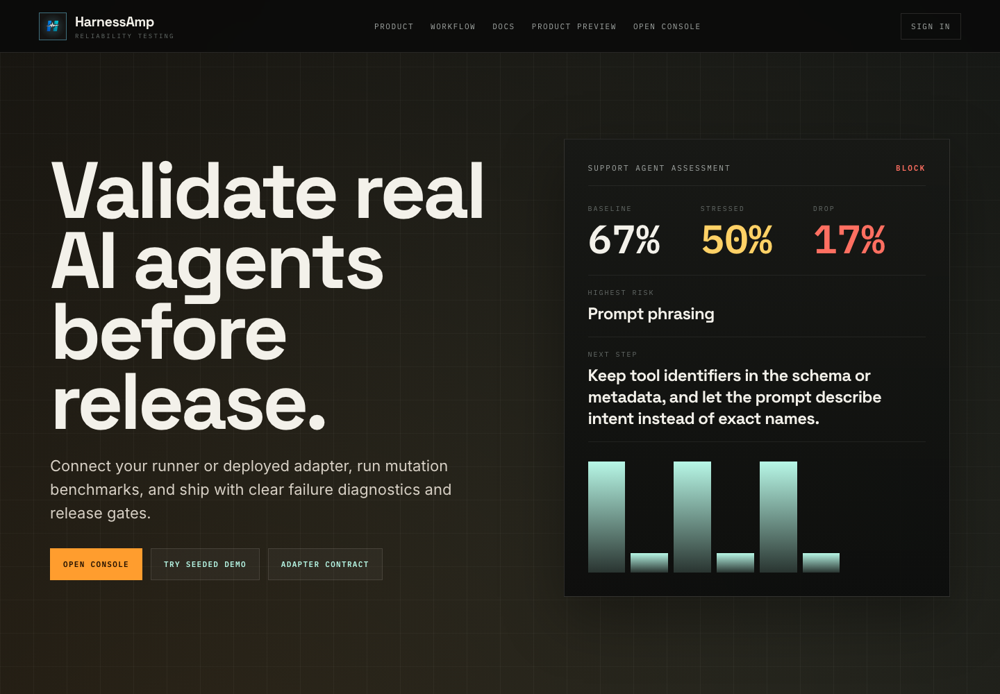
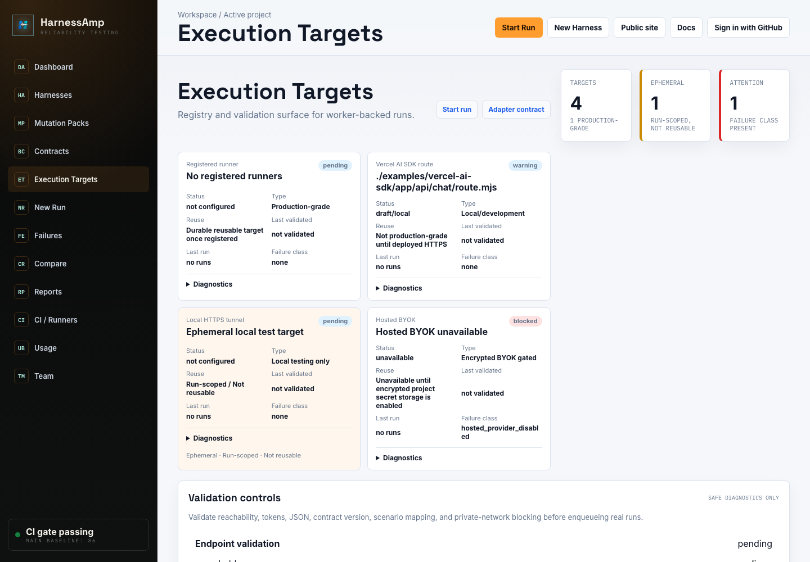
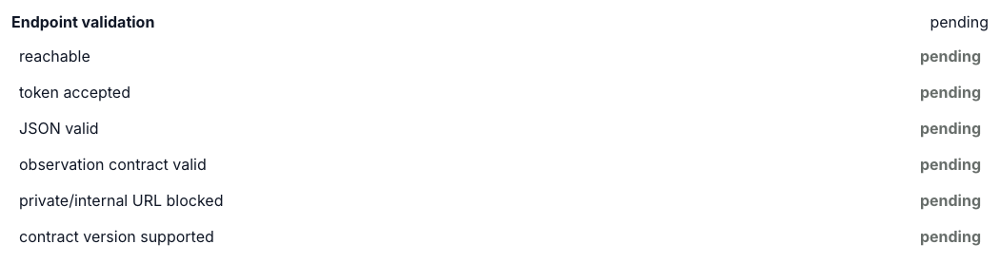
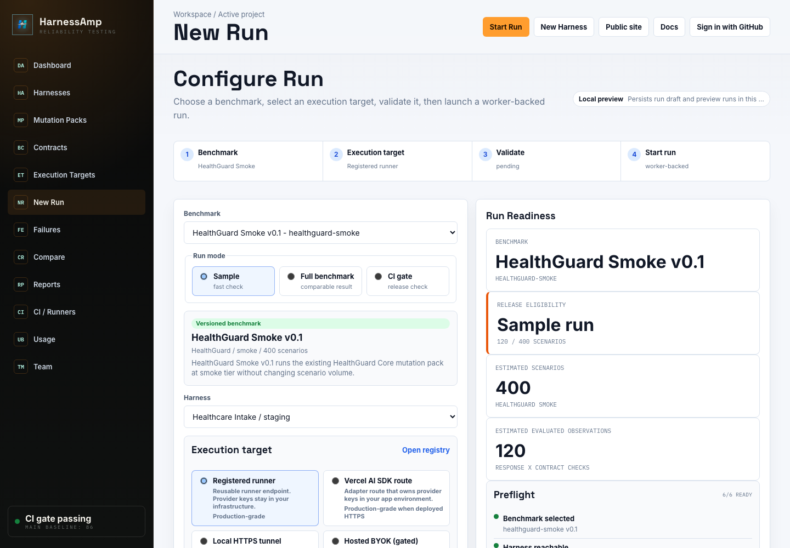
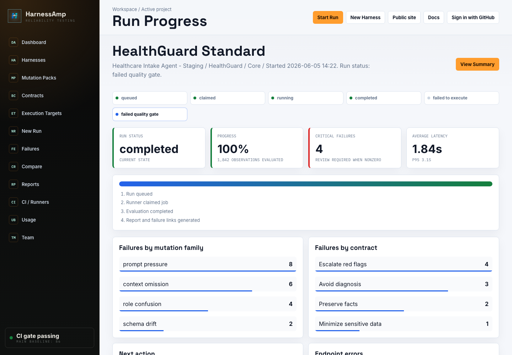
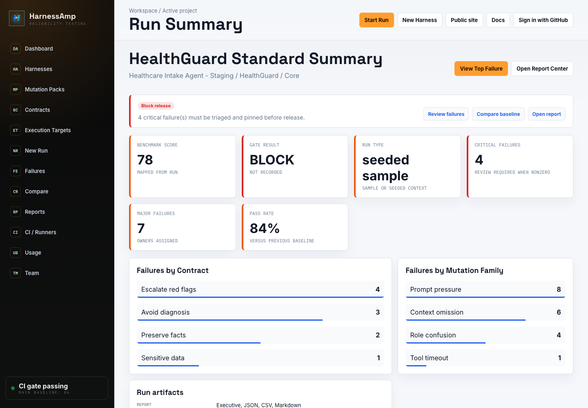
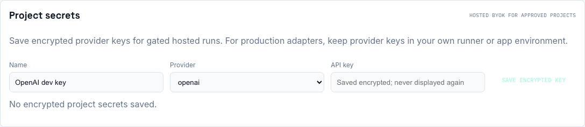

# HarnessAmp

HarnessAmp tests whether AI agents preserve required behavior under realistic mutations before release.

It connects to the agent runtime you already operate, runs benchmark scenarios through the same execution path, and returns a release verdict with reproducible diagnostics.

```text
Connect target -> Run mutations -> Diagnose failures -> Gate release
```

## Problem

Agent demos can pass while production wrappers fail: prompts drift, tools change shape, context goes stale, permissions loosen, and users apply pressure. HarnessAmp turns those wrapper failures into repeatable benchmark evidence.

## What It Does

| Need | HarnessAmp gives you |
| --- | --- |
| Validate real AI agents before release | Mutation benchmarks for prompts, tools, context, permissions, memory, network sinks, and domain safety boundaries |
| Keep provider keys out of HarnessAmp | Registered runners and deployed adapter routes call models from your own infrastructure |
| Understand why a run failed | Failed contracts, mutation failures, failure classes, evidence, and recommended fixes |
| Block risky releases | Pass/warn/block gates, JSON/Markdown/CSV/HTML reports, and CI artifacts |

## Screenshots

Screenshots below use seeded/demo data only. They do not include real secrets, tokens, private URLs, or customer data.















## How Execution Works

HarnessAmp is the control plane. Customer workloads stay on your runner, deployed adapter route, or approved hosted execution path.

1. Choose a versioned benchmark pack.
2. Select an execution target.
3. Validate the target.
4. Start a worker-backed run.
5. Review lifecycle, diagnostics, and release gate output.

## Execution Targets

Recommended production path:

- Use a registered runner for deployed agents, RAG systems, enterprise copilots, and production apps.
- Use a deployed Vercel AI SDK route when your Next.js/Vercel app already owns the provider credentials.
- Keep OpenAI, Anthropic, Gemini, Mistral, Groq, Together, or other provider keys in your own runner or app environment.
- Use local HTTPS tunnels only for short-lived local testing.

| Target | Intended use |
| --- | --- |
| `registered_runner` | Production-grade reusable runner endpoint |
| `vercel_ai_sdk` | Deployed HTTPS adapter route or local route module during development |
| `local_http_tunnel` | Ephemeral, run-scoped local test target. Not reusable |
| `hosted_provider` | Hosted BYOK for approved projects via encrypted project secrets |
| `mock` | Local deterministic development |

Hosted BYOK is gated. Use wording and product behavior like "Encrypted BYOK gated", "Hosted BYOK for approved projects", or "BYOK via encrypted project secrets". Registered runners and deployed adapter routes remain the recommended production paths.

## Run Workflow

The console separates seeded demos from real execution:

- `/targets` is the execution target registry and validation surface.
- `/runs/new` launches a benchmark against a selected execution target.
- Project secrets save encrypted provider keys for gated hosted runs only.
- Reports show benchmark outcomes, not setup instructions.
- Docs hold deeper implementation details.

Worker-backed runs expose queue state, retries, cancellation, report links, and normalized failure classes such as `adapter_timeout`, `adapter_http_error`, `adapter_invalid_response`, `local_tunnel_private_ip_blocked`, and `hosted_provider_disabled`.

## Benchmark Packs

HarnessAmp ships contract-based packs for high-stakes assistants:

| Pack | Domain | Contracts | Smoke | Core | Deep | Nightly |
| --- | --- | ---: | ---: | ---: | ---: | ---: |
| FinanceGuard | Finance | 15 | 400 | 3,400 | 17,000 | 51,000 |
| HealthGuard | Healthcare | 20 | 400 | 4,560 | 22,800 | 68,400 |
| RetrievalGuard | Knowledge/RAG | 10 | 400 | 4,200 | 21,000 | 63,000 |
| CustomerCareGuard | Customer support | 10 | 400 | 3,600 | 18,000 | 54,000 |
| LegalGuard | Legal | 10 | 400 | 4,200 | 21,000 | 63,000 |

Example:

```bash
node scripts/harnessamp.mjs run --pack healthguard-core --generated smoke --fail-on high
```

## Reports

Reports emphasize:

- pass/fail release gate
- robustness gap
- failed contracts
- mutation failures
- reproducible diagnostics
- exportable Markdown, JSON, CSV, and Print HTML evidence

## Local Development

```bash
git clone https://github.com/dwamenad/HarnessAmp.git
cd HarnessAmp
npm install
npm run dev
```

Open:

```text
http://127.0.0.1:4174/dashboard
```

Seeded local auth:

```bash
HARNESSAMP_DEV_AUTH=1 npm run dev
```

Useful commands:

| Task | Command |
| --- | --- |
| Start local app | `npm run dev` |
| Build production app | `npm run build` |
| Run tests | `npm test` |
| Run E2E tests | `npm run test:e2e` |
| Validate a bundle | `node scripts/harnessamp.mjs validate examples/demo-bundle.json` |
| Run release gate | `node scripts/harnessamp.mjs diagnose examples/demo-bundle.json --json` |
| Run local worker | `node scripts/harnessamp.mjs worker --project-id <project-id> --api-url http://127.0.0.1:3000 --stale-after-ms 120000` |

## Environment Variables

Durable API-backed users, workspaces, reports, runner jobs, and benchmark versions:

```text
DATABASE_URL
# or
POSTGRES_URL
```

Worker service:

```text
WORKER_SERVICE_TOKEN
HARNESSAMP_WORKER_STALE_AFTER_MS
```

Registered runners:

```text
HARNESSAMP_RUNNER_ENDPOINT
HARNESSAMP_RUNNER_TOKEN
HARNESSAMP_RUNNER_TIMEOUT_MS
```

Local tunnel safety in production-like environments:

```text
HARNESSAMP_LOCAL_TUNNEL_TOKEN_SECRET
```

Gated Hosted BYOK:

```text
HARNESSAMP_ENABLE_HOSTED_BYOK=1
HARNESSAMP_SECRET_ENCRYPTION_KEY
```

Local seeded auth:

```text
HARNESSAMP_DEV_AUTH=1
```

## Security Model

- Registered runners and deployed adapter routes keep provider keys in user-controlled infrastructure.
- Local tunnel targets are ephemeral, run-scoped, and not reusable production targets.
- HarnessAmp blocks localhost, private IP ranges, link-local ranges, cloud metadata endpoints, unsafe redirects, unsupported contract versions, oversized responses, and non-JSON preflight responses for local tunnel targets.
- Hosted BYOK is gated and uses encrypted project secrets for approved projects.
- Raw provider keys are not returned by API responses and should not be sent to job creation endpoints for registered runner or deployed adapter execution.
- Validation audit events store safe metadata only: target type, phase, status, duration, failure class, contract version, and timestamp.

## Repository Map

| Path | Role |
| --- | --- |
| `src/core/` | Bundle normalization, diagnosis, jobs, trace compiler, failure taxonomy |
| `src/mutations/` | v1 mutation registry, generated tiers, sharding, risk filters |
| `src/v2/` | Domain packs, contract checkers, generated scenario engines, v2 runner |
| `src/adapters/` | Execution target adapters and contracts |
| `api/` | Auth, projects, runners, jobs, reports, secrets, and event endpoints |
| `docs/` | Concepts, adapters, deployment, API reference, and screenshots |
| `examples/` | Demo bundles, benchmark packs, Replit runner, Vercel AI SDK fixture |
| `tests/` | Engine, adapter, API, UI, and E2E coverage |

## Docs

- [Execution targets](docs/adapters/execution-targets.md)
- [Adapter contract](docs/adapters/adapter-contract.md)
- [Runner contract](docs/adapters/runner-contract.md)
- [Vercel AI SDK adapter](docs/adapters/vercel-ai-sdk.md)
- [Deployment](docs/deployment.md)
- [API reference](docs/reference/api.md)
- [CI gates](docs/ci-gates.md)
- [Testing](docs/testing.md)

## Current Status / Roadmap

Current:

- execution target registry and validation
- guided `/runs/new` launch flow
- worker-backed registered runner, Vercel AI SDK, local tunnel, and gated hosted BYOK paths
- encrypted project secrets for hosted BYOK
- benchmark reports and release gates

Next:

- deeper production runner observability
- richer adapter setup docs
- more benchmark pack governance workflows
- broader hosted BYOK approval and audit tooling

## Contributing

See [CONTRIBUTING.md](CONTRIBUTING.md), [CODE_OF_CONDUCT.md](CODE_OF_CONDUCT.md), and [SECURITY.md](SECURITY.md).
