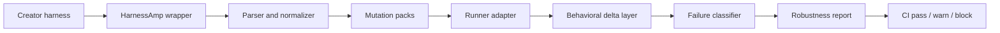

# Architecture

HarnessAmp is organized as a reliability layer around external agent systems.

## Source Boundaries

The source tree is split by ownership:

- `src/core/` - normalization, trace compilation, diagnosis, failure taxonomy, sample bundles, and sample traces
- `src/mutations/` - deterministic mutation registry, mutation pack selection, and mutation suite generation
- `src/adapters/` - runner abstraction and infrastructure adapter classes
- `src/reports/` - failure corpus and report-oriented artifacts
- `src/cli/` - CLI command manifest and future command coordination helpers
- `src/main.js` - browser workbench UI

The old top-level files such as `src/engine.js` and `src/runners.js` are compatibility shims that re-export the new package boundaries.

## Product Model

Inside the product, the analysis model is four-layered:

1. `intent` - the mission that should remain stable
2. `contract` - the hard constraints and role boundaries
3. `benchmark` - the cases and assertions proving the contract
4. `wrapper` - the mutable prompt, tool, schema, and runtime surface

Only the wrapper should drift under test.

## Runtime Flow

1. Load a creator harness.
2. Normalize it into the HarnessAmp bundle format.
3. Select mutation packs from the risk profile.
4. Generate deterministic mutated harnesses.
5. Run baseline and mutated harnesses through a runner adapter.
6. Compute behavioral deltas.
7. Classify failures.
8. Generate a diagnostic report.
9. Return a CI recommendation: `PASS`, `WARN`, or `BLOCK`.

## Operational Artifacts

The repo supports four distinct artifacts:

- `benchmark pack` - what should be preserved
- `analysis export` - what changed under mutation
- `failure corpus` - what actually broke across runs
- `mutation registry` - the structured stressors used to find reliability boundaries

Supporting content lives in:

- `examples/` for starter bundles and sample packs
- `tests/` for engine, mutation, diagnosis, and conformance coverage
- `docs/` for operator-facing references
