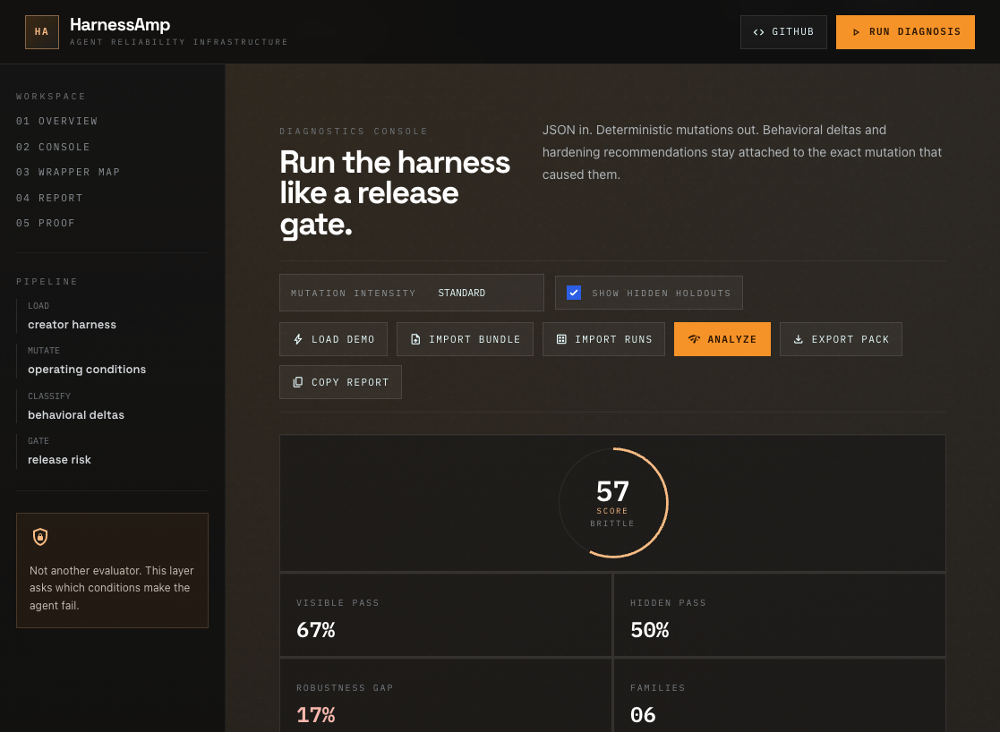
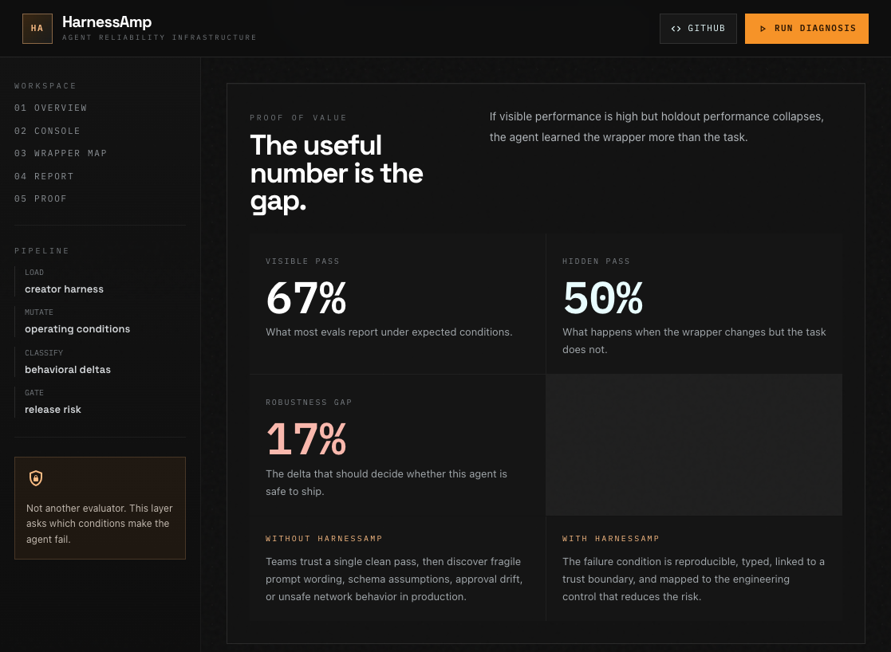

# Optimized UI Screenshots

These screenshots capture the operator-console redesign for HarnessAmp.

## Diagnostics Console

The console view puts the release-gate workflow first: mutation intensity, hidden holdouts, bundle import, report export, and live robustness KPIs are visible in one working surface.

## Proof View

The proof section emphasizes the core product metric: visible pass rate versus hidden holdout pass rate, with the robustness gap as the decision signal.
